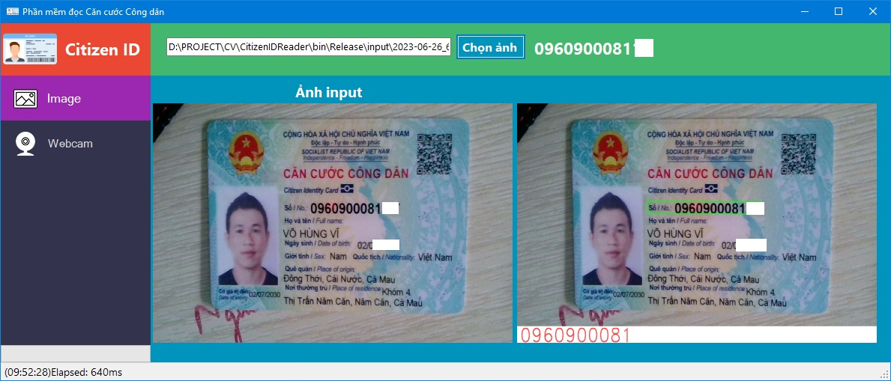
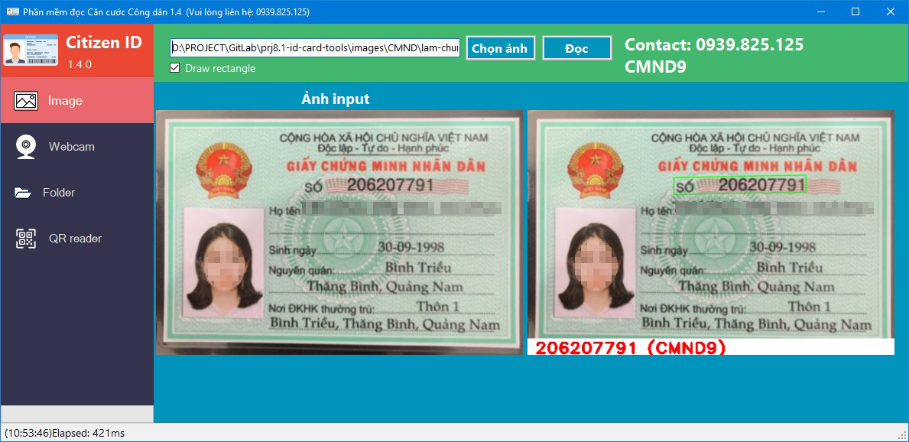
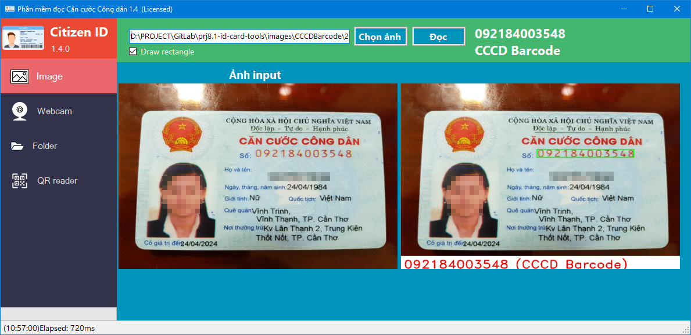
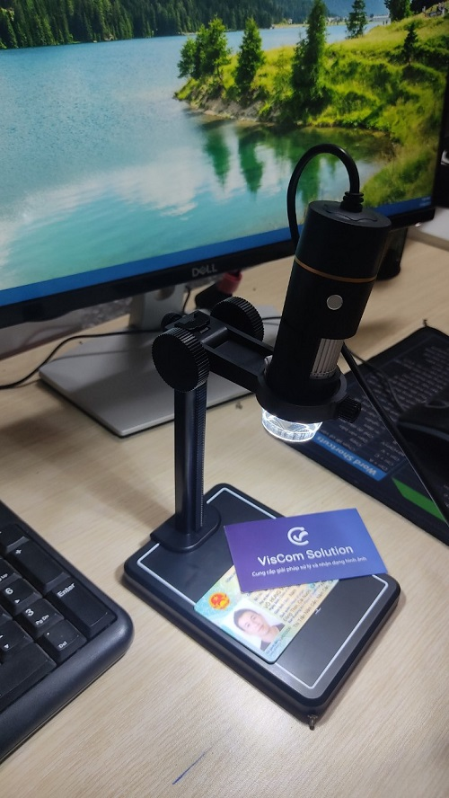

# CitizenIDReader

Phần mềm đọc Căn cước công dân

https://viscomsolution.com/phan-mem-doc-thong-tin-can-cuoc-cong-dan/

## Tính năng
- Đọc mã số CMND và CCCD
- Đọc được các loại giấy: CMND 9 số, CMND 12 số, CCCD barcode và CCCD gắn chip
- Đọc QR code trên CCCD gắn chip

## Demo chức năng
Để test độ chính xác của phần mềm quý khách có thể chạy chương trình build sẵn (.exe) tại đường dẫn:
https://viscomsolution.com/download/CitizenIDReader.zip

Quý khách cần cài đặt thư viện để chạy chương trình:
- Microsoft .NET Framework 4.6.1: https://dotnet.microsoft.com/en-us/download/dotnet-framework/net461
- C++ Redistributable 2017 x64:   https://aka.ms/vs/17/release/vc_redist.x64.exe

Cần có Webcam hiển vi để đọc QR code

## Build source code example

Chúng tôi có kèm theo source code example cách gọi hàm.

Thông tin về source code example:
- Viết bằng ngôn ngữ C# và VB.NET
- Chỉ có 1 phiên bản x64
- Build bằng Visual Studio 2017 trở lên
- Chỉ chạy trên Windows 10 x64 (Không hỗ trợ Windows 7, Windows 10 x86)
- Kết quả trả về bao gồm: mã số CMND/CCCD, mã lỗi (nếu có)
	
	
## Thông tin liên hệ & mua license key
	
Võ Hùng Vĩ
Phone/zalo: 0939825125